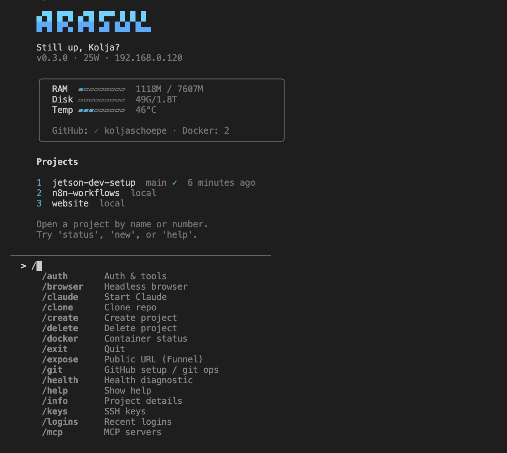

<div align="center">

# OpenAra

**Your own AI dev server. Run Claude Code sessions in dedicated projects — each with its own context, tools, and environment — on hardware you control.**

[](https://github.com/koljaschoepe/OpenAra/actions/workflows/ci.yml)
[](https://codecov.io/gh/koljaschoepe/OpenAra)
[](LICENSE)
[](https://www.python.org/downloads/)

One command turns a Raspberry Pi or Jetson into a secure, always-on dev server.<br>An interactive TUI lets you create projects, launch Claude Code, and manage everything from your terminal.

[Quick Start](#quick-start) · [Features](#what-you-get) · [TUI Commands](#arasul-tui) · [Platforms](#platform-support)

</div>

<br>

<p align="center">
  
</p>

## Why OpenAra?

AI coding agents like [Claude Code](https://docs.anthropic.com/en/docs/claude-code) work best with dedicated project contexts — their own files, environment, and tools. OpenAra gives you a personal server for exactly that: SSH in from anywhere, spin up isolated projects, and let Claude Code work with full context while your laptop stays free.

The setup takes 30 minutes. You get a hardened, optimized dev server with Docker, dev tools, and an interactive TUI to manage projects, Git, MCP servers, and services — no manual config needed.

Built for solo developers, AI researchers, and anyone who wants their own machine for AI-assisted development, automation workflows, or self-hosted projects.

## Platform Support

| Platform | Models | Storage | GPU | Status |
|----------|--------|---------|-----|--------|
| **NVIDIA Jetson** | Orin Nano/NX/AGX, Xavier, TX2 | NVMe, USB-SSD, SD | CUDA | Full support |
| **Raspberry Pi** | Pi 4 (4GB+), Pi 5 | NVMe (M.2 HAT+), USB-SSD, SD | — | Full support |
| **Generic Linux** | Any aarch64 / x86_64 | Auto-detected | — | Basic support |

Hardware is auto-detected — OpenAra adapts to your platform automatically.

## Quick Start

**Prerequisites:** Raspberry Pi 4/5 or NVIDIA Jetson with a fresh OS, network connection, and an [SSH key](docs/ssh-setup.md) on your workstation. New to this? See the [Hardware Setup Guide](docs/hardware-setup.md) for flashing your OS and installing storage.

```bash
# On the device (via SSH):
git clone https://github.com/koljaschoepe/OpenAra.git
cd OpenAra
sudo ./setup.sh
```

The setup wizard detects your hardware, asks 3 questions, shows an installation plan, and configures everything:

```
╭─────────────────────────────────────╮
│  Arasul Setup Wizard                │
╰─────────────────────────────────────╯

  Detected: Raspberry Pi 5 Model B (aarch64, 8192 MB RAM)
  Storage:  NVMe (/dev/nvme0n1)

  ✓ Step 1: System optimization
  ✓ Step 2: Network (hostname, mDNS, firewall)
  ✓ Step 3: SSH hardening (key-only auth, fail2ban)
  ✓ Step 4: Storage setup (NVMe/SSD, swap)
  ✓ Step 5: Docker + Compose
  ✓ Step 6: Dev tools (Node.js, Python, Claude Code)
  ✓ Step 7: Quality of life (tmux, aliases, MOTD)
  ○ Step 8: Headless browser (Playwright)
  ○ Step 9: n8n workflow automation
  ○ Step 10: Miniforge3 (conda package manager)

  Proceed? [Y/n/customize]:
```

After reboot:

```bash
ssh dev.local
arasul          # Start the management TUI
```

## What You Get

### Security — hardened out of the box

- **SSH key-only auth** — passwords disabled, Ed25519 keys only
- **fail2ban** — 3 failed attempts = 1h ban, repeat offenders = 1 week
- **UFW firewall** — deny all incoming, only SSH + mDNS allowed
- **Auto security updates** — unattended-upgrades for critical patches
- **Network hardening** — SYN cookies, reverse-path filter, no redirects

### Performance — tuned for SBCs

- **Storage auto-detection** — NVMe > USB-SSD > SD, projects on fastest available
- **Kernel tuning** — swappiness, cache pressure, dirty ratio optimized for low RAM
- **OOM protection** — SSH and Docker protected from out-of-memory killer
- **I/O scheduler** — tuned per storage type (NVMe/SSD/SD)
- **Service minimization** — desktop, print, WiFi disabled on headless

### Dev Environment — ready to code

- **Docker + Compose** — data on fast storage, NVIDIA Runtime on Jetson
- **Node.js 22 + Python 3** — current LTS versions
- **Claude Code CLI** — AI pair programming out of the box
- **tmux + aliases** — persistent sessions, platform-specific shortcuts
- **Headless browser** — Playwright + Chromium for AI agent automation (optional)
- **n8n** — workflow automation with MCP integration (optional)

## Arasul TUI

The interactive management interface. 24 commands across 10 categories:

```bash
arasul          # launch (or alias: atui)
```

| Category | Commands |
|----------|----------|
| **Projects** | `/create`, `/clone`, `/open`, `/delete`, `/info`, `/repos` |
| **AI** | `/claude`, `/auth` |
| **Git** | `/git` (setup wizard), `/git pull`, `/git push`, `/git log`, `/git status` |
| **System** | `/status`, `/health`, `/setup`, `/docker` |
| **Security** | `/keys`, `/logins`, `/security` |
| **Browser** | `/browser` (smart flow: status → install → test → MCP) |
| **MCP** | `/mcp list\|add\|test\|remove` |
| **Services** | `/n8n` (smart flow: install → start → API key → MCP), `/n8n stop` |
| **Network** | `/tailscale status\|install\|up\|down`, `/expose on\|off\|status` |
| **Meta** | `/help`, `/exit`, `/welcome` |

Keyboard shortcuts: `1-9` select project, `n` new, `d` delete, `c` Claude, `g` lazygit, `b` back.

### Project Templates

Create projects with pre-configured conda environments:

```bash
/create my-api --type api          # FastAPI      (all platforms)
/create my-nb  --type notebook     # Jupyter      (all platforms)
/create my-app --type webapp       # Web app      (all platforms)
/create my-ml  --type python-gpu   # GPU / CUDA   (Jetson only)
/create my-cv  --type vision       # Computer vision (Jetson only)
```

## Daily Workflow

```bash
ssh mydevice                    # Connect — TUI starts automatically
3                               # Select project by number
c                               # Launch Claude Code in that project
```

That's it. The Arasul TUI starts on every SSH login, shows your projects, and launches Claude Code in the right directory. Your server is always on, your projects persist, and Claude picks up right where you left off.

> **Tip:** For persistent sessions that survive SSH disconnects, use `t` after exiting the TUI to start a tmux session.

## Setup Options

```bash
sudo ./setup.sh                 # Interactive wizard (default)
sudo ./setup.sh --interactive   # Configure .env first, then wizard
sudo ./setup.sh --auto          # Run all steps, no prompts
sudo ./setup.sh --step 4        # Run a single step
```

All scripts are idempotent — safe to run multiple times.

<details>
<summary><strong>Configuration</strong></summary>

The setup wizard creates `.env` automatically. You can also configure manually:

```bash
cp .env.example .env
nano .env
```

Only `CUSTOMER_NAME` and `DEVICE_USER` are required — everything else is auto-detected. Full template: [`.env.example`](.env.example).

</details>

<details>
<summary><strong>Platform-Specific Notes</strong></summary>

### NVIDIA Jetson

- CUDA available in Docker via `--runtime=nvidia`
- 8GB shared CPU/GPU RAM — no desktop, minimize services
- NVMe recommended (flash directly via SDK Manager)
- Power modes configurable via `POWER_MODE` in `.env`
- TUI shows GPU %, power mode, temperature

### Raspberry Pi

- **Pi 5:** NVMe via M.2 HAT+ for best performance
- **Pi 4:** USB-SSD recommended, microSD for boot only
- 4GB tight (skip browser), 8GB comfortable
- No CUDA — GPU templates unavailable
- TUI shows CPU temp, throttle status

### Generic Linux

- Falls back to hostname for model identification
- Auto-detects NVMe/USB drives, falls back to home directory
- Useful for CI runners, x86 dev machines, cloud VMs

</details>

<details>
<summary><strong>Repository Structure</strong></summary>

```
├── setup.sh                    # Main orchestrator (wizard + auto)
├── install.sh                  # One-liner installer
├── lib/
│   ├── common.sh               # Shared shell library
│   └── detect.sh               # Hardware detection
├── arasul_tui/                 # Interactive TUI (Python)
│   ├── app.py                  # Entry point
│   ├── commands/               # 11 command modules
│   └── core/                   # Platform, state, registry, UI
├── tests/                      # 501 tests, 70% coverage
├── scripts/
│   ├── 01-system-optimize.sh
│   ├── 02-network-setup.sh
│   ├── 03-ssh-harden.sh
│   ├── 04-storage-setup.sh
│   ├── 05-docker-setup.sh
│   ├── 06-devtools-setup.sh
│   ├── 07-quality-of-life.sh
│   ├── 08-browser-setup.sh
│   ├── 09-n8n-setup.sh
│   └── 10-miniforge-setup.sh
├── config/                     # tmux, aliases, MOTD, SSH template
└── .github/workflows/          # CI, CodeQL, Release automation
```

</details>

<details>
<summary><strong>Troubleshooting</strong></summary>

| Problem | Solution |
|---------|----------|
| SSH connection refused | `systemctl status sshd` |
| Permission denied (publickey) | `ssh-copy-id user@device` |
| `.local` not resolving | `systemctl status avahi-daemon` |
| NVMe/SSD not detected | Check `lsblk` — NVMe must be PCIe, not SATA M.2 |
| Docker won't start | `journalctl -u docker` |
| GPU not available (Jetson) | Check `--runtime=nvidia` flag |
| OOM kills | `free -h` — add `--memory=2g` limits to containers |
| Slow storage | `sudo smartctl -a /dev/nvme0n1` |

</details>

<details>
<summary><strong>Maintenance</strong></summary>

Most maintenance runs automatically. For manual checks:

```bash
sudo apt update && sudo apt upgrade -y   # System updates
docker system prune -af --volumes         # Docker cleanup (also weekly cron)
sudo smartctl -a /dev/nvme0n1            # Storage health
sudo ufw status verbose                   # Firewall status
sudo fail2ban-client status sshd          # Ban status
```

</details>

<details>
<summary><strong>Uninstall</strong></summary>

**Full reset:** Re-flash your SD card or NVMe.

**Remove Arasul TUI only:**

```bash
pip uninstall arasul
sudo rm -f /usr/local/bin/arasul
rm -rf ~/.config/arasul
```

**Undo setup changes:** Re-run individual scripts with default Ubuntu settings, or restore the `.arasul-backup.*` files created during setup.

</details>

<details>
<summary><strong>Migrating from Jetson-Only Setup</strong></summary>

If you used an earlier version with `JETSON_*` variables:

- Old `.env` variables (`JETSON_USER`, `NVME_MOUNT`, etc.) still work — mapped automatically
- `/mnt/nvme` paths continue to work if that's your mount point
- Run `sudo ./setup.sh` to pick up platform-aware improvements

</details>

## Contributing

Contributions welcome! See [CONTRIBUTING.md](CONTRIBUTING.md) for guidelines.

- [Security Policy](SECURITY.md) — how to report vulnerabilities
- [Code of Conduct](CODE_OF_CONDUCT.md) — community standards

## License

[Business Source License 1.1](LICENSE) — free for personal, internal, and non-commercial use. Converts to Apache 2.0 on 2030-03-09.

For commercial licensing, contact [kolja@koljaschoepe.dev](mailto:kolja@koljaschoepe.dev).
